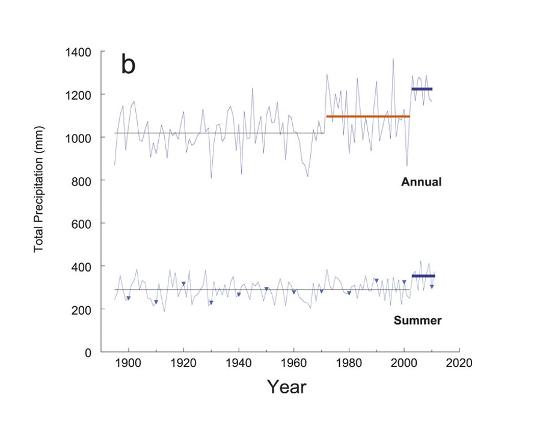
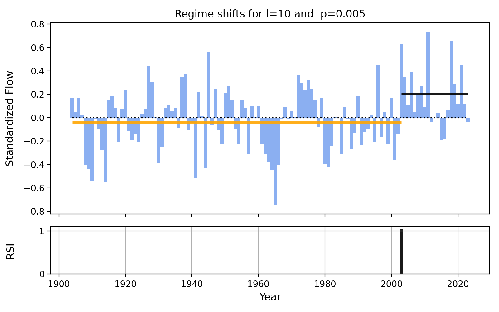
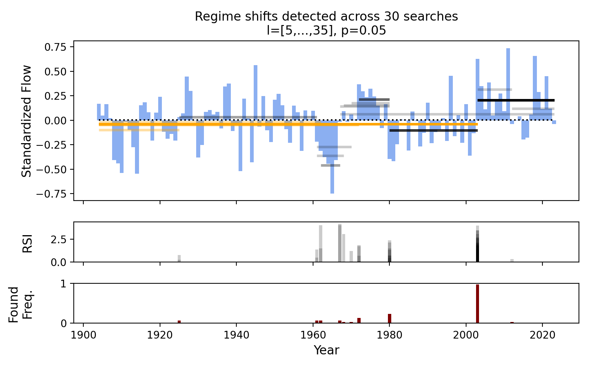

# Rodionov's Regime Shift Detection Algorithm and the "Epic Pluvial" the Delaware Basin

In their 2013 publication, Pederson et al. try to answer the question posed by the title: [*Is an Epic Pluvial Masking the Water Insecurity of the Greater New York City Region?*](https://journals.ametsoc.org/view/journals/clim/26/4/jcli-d-11-00723.1.xml?tab_body=fulltext-display)

To help answer this question, they first reconstruct 472 years of [*Palmer Drought Severity Index*](https://climatedataguide.ucar.edu/climate-data/palmer-drought-severity-index-pdsi)(PDSI) for the region, created using tree-ring chronologies, and show that study the hydroclimate patterns over the historic record. The reconstructed PDSI, along with measured meteorological data dating back to 1895 are used to assess trends the region's hydroclimate.

Their analysis shows that the upper Delaware River Basin (source of NYC drinking water) has experienced a prolonged wet period since the early 1970s, and that the water availability experienced between 1970 until the time of writing may not be representative of what is "normal" in the context of the past 400 years.

This works supports the findings of [Seager et al. (2012)](https://journals.ametsoc.org/view/journals/clim/25/19/jcli-d-11-00518.1.xml) who also identified the post-1960s "Epic Pluvial", and also compared the observational data with temperature-forced global climate models to show that the wet regime is plausibly explained by internal atmospheric variability of the region. [Lehner and Deser (2023)](https://iopscience.iop.org/article/10.1088/2752-5295/accf30/meta) define internal variability as "fluctuations that arise intrinsically in a non-linear dynamical system, even when that system is closed."

The first figure in Pederson et al. (2013; below) visualizes this shift toward a wetter regime, starting in 1970, along with a second wetter-regime shift again in 2003. The orange line in the figure shows the average precipitation of the wet-regime detected in 1970, which was detected using the [*sequential algorithm for testing climate regime shifts* proposed by Rodionov (2004).](https://doi.org/10.1029/2004GL019448)

When I saw this figure, several of my own questions came to mind:
- Has the wet-regime continued after 2011 (end of study period)?
- This regime shift was detected in precipitation, will it also be detected in streamflow data?




## Post Overview

In this post, I present Rodionov's regime shift detection algorithm, and use it to assess streamflow regime shifts in the upper Delaware River Basin (DRB) from 1904 through the present. 

A Python implementation of the algorithm, the streamflow data studied here, and a Jupyter Notebook used to run the following analysis is all available here: [Rodionov_regime_shifts](https://github.com/TrevorJA/Rodionov_regime_shifts)

## Rodionov's Algorithm

The mathematical details of the algorithm are best described by [Rodionov (2004)](https://agupubs.onlinelibrary.wiley.com/doi/full/10.1029/2004GL019448), and it would not be advantageous for me to replicate those here, but I encourage you to read the formal description in combination with the descriptions here.

Below, I provide both a verbal explanation of the process along with the Python implementation [here: `rodionov.py`](https://github.com/TrevorJA/Rodionov_regime_shifts/blob/main/rodionov.py)

### Rodionov's algorithm in words

***Step 1: Set parameters (l & p)***
In Rodionov's sequential regime algorithm, the first step is to specify the expected minimum length of a regime (denoted as $l$) and a required statistical significance level ($p$) used to test regime differences. 

Additionally, the average variance of all periods of length $l$ in the data record is calculated, and each regime is assumed to have the average variance. 

***Step 2: Determine statistically significant deviation values***
The algorithm defines the threshold for identifying potential new regimes based on how different a value needs to be from the mean of the current regime for it to be considered a *potential regime shift*.

This difference depends on a Student's t-test value, the minimum regime length, average variance, and the user-specified significance level ($p$).

***Step 3: Calculate initial regime statistics***
Assume that the initial regime is the first $l$ days, specified in *Step 1*.

The mean of this initial regime is calculated, and upper and lower significance bounds are established using the difference value obtained in *Step 2*.  Upper and lower bounds are equal to the mean plus/minus the significant difference value.

***Step 4: Identifying potential regime shift points***
One-by-one test each subsequent value in the series to tested to determine if it exceeds the upper or lower bounds established for the current regime distribution.

If the value is inside the bounds of the current regime, then re-calculate the current regime mean including the new point, and move on to the next day. 

If a value is outside the bounds of the current regime, then consider that point as a potential regime shift (*Step 5*).  

***Step 5: Testing a potential regime shift***
Once a potential regime shift is detected, adopt a null hypothesis that the new regime has a mean equal to the statistically significant boundary value of the previous regime distribution that was exceeded.

The regime shift hypothesis is then assessed by calculating the *Regime Shift Index (RSI)*, which is a cumulative measure of exceedances beyond the prior regime's significance value. The cumulative sum of exceedances over the minimum regime length ($l$) defines the RSI for the potential regime shift point.

***Step 6: Rejecting potential regime shifts***
If *RSI* $<0$ at any point within the $l$-periods after the initial shift period, then the new-regime hypothesis is rejected.

When the potential shift is rejected, the mean of the prior regime is modified to incorporate the potential shift point into the distribution, and the analysis continues by returning to *Step 4* to search for additional potential regime shifts.

***Step 7: Accepting regime shifts***
If *RSI* $>0$ after accumulating over the minimum regime length ($l$), then the new regime $R2$ is identified as significant.

Once the new regime is adopted, the mean of the new regime is calculated for the first $l$ periods of $R2$, and new significance bounds are calculated using the significant difference value from *Step 2.* 

The regime-shift-search is continued, starting on the first day of the new regime $R2$ (*Return to Step 4.*) 

Notably, by resuming the search at the *start of $R2$*, regimes can be shorter than the specified minimum length $l$, and re-assessing the values in $R2$ lessens the impact of making assumptions about $l$.  

### Rodionov's algorithm in code

The Python implementation, [`rodionov_regimes()`](https://github.com/TrevorJA/Rodionov_regime_shifts/blob/main/rodionov.py), thus follows:

```python
def rodionov_regimes(data, l, p):
    """Implements Rodionov's (2004) regime shift detection algorithm:
    Rodionov, S. N. (2004). A sequential algorithm for testing climate regime shifts.
    Geophysical Research Letters, 31(9).

    Args:
        data (array): Timeseries array of std values
        l (int): The assumed minimum regime length
        p (float): The singificance probability to use when assessing shifts

    Returns:
        list, list: Two lists: The regime-shift indices, the RSI values
    """

    # Step 1: Set the cut-off length l of the regimes
    # l: Number of years for each regime
    # p: Probability level for significance
    n = len(data)
    regime_shift_indices = []
    rsi = np.zeros(n)
	
	# Step 2: Determine the difference diff for statistically significant mean values
	t_stat = np.abs(t_test.ppf(p, (2*l-2)))
	avg_var = np.mean([np.var(data[i:(i+l)]) for i in range(n-l)])	
	diff = t_stat * np.sqrt(2 * avg_var / l)

	# Step 3: Calculate initial mean for regime R1
    r1 = np.mean(data[:l])
    r1_lower = r1 - diff
    r1_upper = r1 + diff

    i = l + 1
    while i < n:
        # Step 4: Check if the value exceeds the range of R1 ± diff
        if data[i] < r1_lower or data[i] > r1_upper:
            j = i
  
            # Estimate the mean of regime 2 as the upper bound of r1 distribution
            test_r2 = r1_lower if data[i] < r1_lower else r1_upper

            # Step 5: Calculate regime shift index (RSI) across next l-window
            for k in range(j + 1, min(j + l,n)):
                if data[j] > r1:
                    rsi[j] += (data[k] - test_r2)/(avg_var*l)
                elif data[j] < r1:
                    rsi[j] += (test_r2 - data[k])/(avg_var*l)

                # Step 6: Test for a regime shift at year j
                if rsi[j] < 0:
                    rsi[j] = 0
                    break

            # Step 7: Confirm significant regime shift at year j
            if rsi[j] > 0:
                regime_shift_indices.append(j)
                r2 = np.mean(data[j:min(j+l,n)])
                r1 = r2
                r1_lower = r1 - diff
                r1_upper = r1 + diff

            i = j + 1
        else:
            # Recalculate average for R1 to include the new value
            r1 = ((l - 1) * r1 + data[i]) / l
            
        i += 1
    return regime_shift_indices, rsi
```

***
## Usage in the DRB: Detecting streamflow regime shift

Now it is time to try and answer the questions posed earlier:
- Has the wet-regime identified by Pederson et al. (2013) continued after 2011?
- This regime shift was detected in precipitation, will it also be detected in streamflow data?

See the [Rodionov_DRB_regime_demo.ipynb](https://github.com/TrevorJA/Rodionov_regime_shifts/blob/main/Rodionov_DRB_regime_demo.ipynb) to see how the following results are generated.

### Streamflow data

In choosing streamflow data for this study, I looked for a USGS gauge that (A) is in or downstream of the upper DRB region considered by Pederson et al. (2013), and (B) has a long record. 

I settled on [USGS-01434000](https://waterdata.usgs.gov/monitoring-location/01434000/#parameterCode=00065&period=P7D) which is located on the Delaware River near the middle of the basin, and has daily streamflow data dating back to 1904!  I pulled all flow data from 1904 to July, 2023 (present).

Before using Rodionov's algorithm I standardized the flow data by removing seasonality (remove monthly means) and log-transforming the deviations from seasonal means.  

Lastly, I take the annual mean of standardized flow values.  

### Application of Rodionov's algorithm

Running the [`rodionov_regimes()`](https://github.com/TrevorJA/Rodionov_regime_shifts/blob/main/rodionov.py) function is as easy as passing a 1D timeseries array, along with the `l` and `p` parameters.

```python
shift_indices, rsi_values = rodionov_regimes(Z.values.flatten(), l= 10, p= 0.005)
```

The `shift_indices` contains a list of the array indices where a statistically-significant regime shift was detected. The `rsi_values` contains the RSI for each year in the timeseries, and will be 0 whenever there is no regime shift. 

If the lists are empty, then there were no statistically significant regimes detected; consider lowering your statistical confidence requirements (increase `p`) and try again.

In this study, I start by searching for regimes with an assumed minimum length of 10 years (`l= 10`) and significance level of `p= 0.005`.

### Streamflow regime shifts in the DRB

Running Rodionov's algorithm on the standardized streamflow data reveals a significant regime shift toward wetter conditions in 2003:



Notably, the 1970s regime shift reported by Pederson et al. (2013) is *not* detected in the streamflow timeseries, under the initial parameterization.  However, the authors also identified the 2003 regime shift toward wetter conditions, and the 2003 shift was the only shift they detected when analyzing *summer* precipitation (see lower timeseries in the Pederson figure earlier in this post).


The regime shifts found using the Rodionov algorithm is sensitive to the `l` and parameterization, and it may be that Pederson et al. (2013) used a different parameterization (I didn't see it detailed in the publication).  Although, in hydrology is often very difficult to decide on a definitive timescale for hydrologic processes that are highly unpredictable, like wet/dry regimes.  

Rather than specifying a single assumed minimum regime length, I re-ran the Rodionov algorithm using every regime length between 5 and 35.

The figure below shows all of the different regimes determined to be significant across the range of different regime lengths.  I also added a measure of Found Frequency (lower row) which indicates how often a specific year contained a significant regime shift across the 30 instances of the search.



From the above analysis, we can see:
1. Identified regimes are variable in duration, and magnitude depending on the specification 
2. Despite the variability, the 2003 shift toward a wetter regime is identified as being statistically significant in 29/30 of the searches!

## Conclusions

To answer the questions that motivated this post:

- Has the wet-regime identified by Pederson et al. (2013) continued after 2011?

Yes!  Based on the Rodionov algorithm, it seems clear that the period 2011-2023 continues to be classified as a significantly wet period. 

- This regime shift was detected in precipitation, will it also be detected in streamflow data?

Yes, kinda! Extension of the work by Pederson et al. (2013) to include streamflow does show that the wet regime is detected in the streamflow record, however it is not clear that the regime started in 1970. However, the 2003 shift is also reported by Pederson et al. (2013) and clearly detected in the streamflow timeseries.

If you've made it this far, thank you for reading!


## References

Lehner, F., & Deser, C. (2023). Origin, importance, and predictive limits of internal climate variability. _Environmental Research: Climate_, _2_(2), 023001.

Pederson, N., Bell, A. R., Cook, E. R., Lall, U., Devineni, N., Seager, R., ... & Vranes, K. P. (2013). Is an epic pluvial masking the water insecurity of the greater New York City region?. _Journal of Climate_, _26_(4), 1339-1354.

Rodionov, S. N. (2004). A sequential algorithm for testing climate regime shifts. _Geophysical Research Letters_, _31_(9).

Seager, R., Pederson, N., Kushnir, Y., Nakamura, J., & Jurburg, S. (2012). The 1960s drought and the subsequent shift to a wetter climate in the Catskill Mountains region of the New York City watershed. _Journal of Climate_, _25_(19), 6721-6742.
